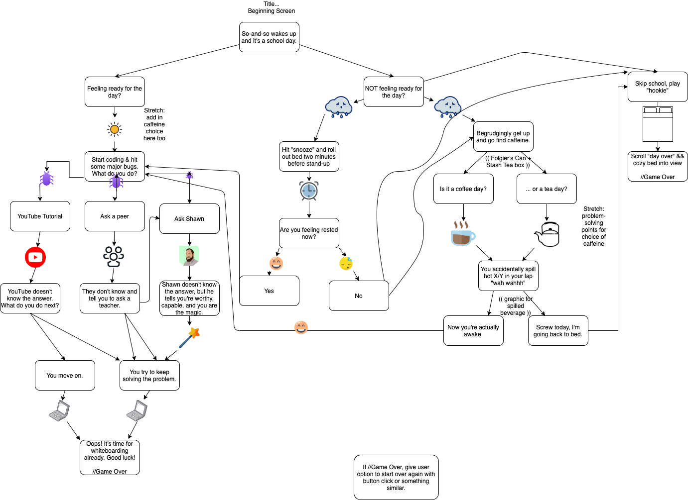

# Choose Your Own Adventure

## Three-day In-Class Assignment Working with React & Redux for Epicodus, Week 19

### By Garrett Dean Brown & Danielle Thompson

### Project began 3.1.21. Last updated 3.4.21.

---

### Get in Touch

danithompson74 at gmail.com | [LinkedIn](https://www.linkedin.com/in/danielle-thompson74/)
gman9mm at live.com | [LinkedIn](https://www.linkedin.com/in/garrett-brown-d/)

### Known Bugs

_No known bugs at this time._

[Report bugs here.](https://github.com/dani-t-codes/tap-room-redux/issues) | [Request features here.](https://github.com/dani-t-codes/tap-room-redux/issues)

---

<!-- START doctoc generated TOC please keep comment here to allow auto update -->
<!-- DON'T EDIT THIS SECTION, INSTEAD RE-RUN doctoc TO UPDATE -->

**Table of Contents** _generated with [DocToc](https://github.com/thlorenz/doctoc)_

- [Description](#description)
  - [Objectives](#objectives)
- [Component Diagram](#component-diagram)
- [User Stories](#user-stories)
- [Wireframe](#wireframe)
- [Stretch Goals](#stretch-goals)
- [Technologies Used](#technologies-used)
  - [Setup/Installation Requirements](#setupinstallation-requirements)
    - [Running the Project Locally](#running-the-project-locally)
      - [For Mac Users](#for-mac-users)
      - [For Windows Users](#for-windows-users)
      - [For Both Mac & Windows systems](#for-both-mac--windows-systems)
    - [Available Scripts](#available-scripts)
      - [`npm start`](#npm-start)
      - [`npm test`](#npm-test)
      - [`npm run build`](#npm-run-build)
      - [`npm run eject`](#npm-run-eject)
    - [Legal, or License](#legal-or-license)

<!-- END doctoc generated TOC please keep comment here to allow auto update -->

## Description

This choose-your-own-adventure application walks you through the various choices an Epicodus faces during any given day of class.

### MVP Objectives

- React.js front-end with a focus on animations & parallax scrolling with React-Spring
- Hard-code back-end responses (prompts/choices)
- Stretch goal: refactoring hard-coded responses, etc. with C# as back-end
- ** Make sure that we systemize how hard coding, etc happens. (CRUD??)

Start by setting up front end ...

- with state(gameStarted: true/false, prompt, choices, turn(?))
--> React only, no Redux.

Things that are repeatable:

- Form to make choices
- Prompts
- Parallax scroll with repeatable background/images

## Component Diagram

---

## User Stories

| #   | Stories                                                                                                                                            |
| --- | -------------------------------------------------------------------------------------------------------------------------------------------------- |
| 1   | A user should be able to Create, Update, Delete, and see list and details of kegs in the tap room.                                                 |
| 2   | Decrease kegQuantity remaining per keg when a pint is purchased. For instance, if a user clicks "Buy", the quantity will decrease by one.          |
| 3   | When the quantity of an keg is reduced to 0, the keg should say "Out of Stock". A user should not be able to reduce the quantity of a keg below 0. |
| 4   | When the quantity of an keg is reduced to 0, the user should be prompted with the option to restock the keg.                                       |
| 5   | When there is a keg in the inventory that is extra expensive, the user should see the details of the keg listed in red font, not black.            |

---

## Story Board Flow Charts

## Stretch Goals

- Implement more CSS/CSS objects

## Technologies Used

- [VS Code](https://code.visualstudio.com/download)
- Git & GitHub
- ES6 JavaScript
- JSX
- React Framework v17.0
- React-Spring
- npm
- node.js
- `create-react-app`
- `npm install --save-exact react-scripts@3.2.0`
- `npm install react-spring`
- webpack v5.11.1
- Babel
- ESLint
- node.js v15.8.0
- Bootstrap v5.0.0
- [Unsplash](unsplash.com)

---

### Setup/Installation Requirements

- To access the live page visit ... TODO

##### Running the Project Locally

###### For Mac Users

- Access Terminal in your Finder, and open a new window. Install the package manager, [Homebrew](https://brew.sh/), on your device by entering this line of code in Terminal: `$ /usr/bin/ruby -e "$(curl -fsSL https://raw.githubusercontent.com/Homebrew/install/master/install)"`.
- Ensure Homebrew packages are run with this line of code: `echo 'export PATH=/usr/local/bin:$PATH' >> ~/.bash_profile`.
- Once homebrew is installed, install Git, a version control system for code writers, with this line of code `brew install git`.
- Now, install Node.js through Homebrew with the following command: `brew install node`.
- Confirm that node and npm (Node's package manager that is automatically installed alongside Node) are on your working system with two command lines `node -v` & `npm -v`, respectively returning something resembling `v14.5.0` & `6.14.5` (or higher).

###### For Windows Users

- Open a new Command Prompt window by typing "Cmd" in your computer's search bar.
- Determine whether you have 32-bit or 64-bit Windows by following these [instructions](https://support.microsoft.com/en-us/help/13443/windows-which-version-am-i-running).
- Go to [Git Bash](https://gitforwindows.org/), click on the "Download" button, and download the corresponding exe file from the Git for Windows site.
- Follow the instructions in the set up menu.

###### For Both Mac & Windows systems

- Once you have Git installed on your computer, go to this [GitHub repository](https://github.com/dani-t-codes/choose-your-own-adventure), click the "Fork" button in the upper right hand corner of the page, and clone this application with the following command:`git clone https://github.com/dani-t-codes/choose-your-own-adventure.git`.
- Go to the [Node.js website](https://nodejs.org/en/download/) and download the appropriate source code for your Windows operating system.
- Once the project has been cloned to your computer and you have all the necessary items on your local computer, open the project in the application of your choice.

##### Available Scripts

In the project directory, you can run:

###### `npm start`

Runs the app in the development mode.\
Open [http://localhost:3000](http://localhost:3000) to view it in the browser.

The page will reload if you make edits.\
You will also see any lint errors in the console.

###### `npm test`

Launches the test runner in the interactive watch mode.\

###### `npm run build`

Builds the app for production to the `build` folder.\
It correctly bundles React in production mode and optimizes the build for the best performance.

###### `npm run eject`

**Note: this is a one-way operation. Once you `eject`, you can’t go back!**

---

#### Legal, or License

This software is licensed under the [MIT License](https://choosealicense.com/licenses/mit/).

Copyright (c) 2021 _*Garrett Dean Brown & Danielle Thompson*_

